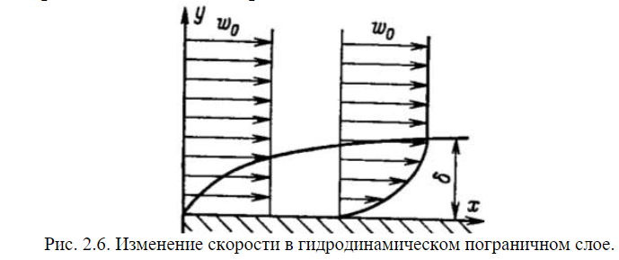
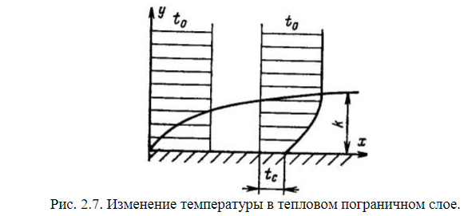

# Примеры точных решений задач гидродинамики. Понятия гидродинамического и теплового пограничных слоев

## Система уравнений описывающая вынужденную/свободную конвекцию

$$
\rho\frac{d\overline{w}}{dt}=\rho\overline{g}-\nabla{p} + \mu\nabla^{2}{\overline{w}} \text{ - Уравнение движения}  
$$

$$
\frac{\partial{T}}{\partial{t}} + \overline{w}\nabla{T} = a\Delta{T} + \frac{q_ {v}}{\rho c_p} \text{ - уравнение энергии}
$$

$$
div(\overline{w}) \equiv \frac{\partial{w_ {x}}}{\partial x} + \frac{\partial{w_ {y}}}{\partial y} + \frac{\partial{w_ {z}}}{\partial z} \text{ - уравнение неразрывности}
$$

Здесь как и раньше (Пример для компоненты X): $\frac{dw_ {x}}{dt} = \frac{\partial{w_ {x}}}{\partial{t}} + w_ {x}\frac{\partial{w_ {x}}}{\partial{x}} + w_ {y}\frac{\partial{w_ {x}}}{\partial{y}} + w_ {z}\frac{\partial{w_ {x}}}{\partial{z}}$

Для **свободной конвекции** уравнение движения:

$$
\frac{d\overline{w}}{dt} = -\overline{g}\beta\Delta{T} - \frac{1}{\rho}\nabla{p} + \nu\nabla^{2}{\overline{w}}
$$

Принципиальное отличие от случая вынужденного течения состоит в том, что **порождающим членом** в уравнении движения, определяющим причину возникновения и поддержки (энергетической подпитки течения неизотермической вязкой и теплопроводной жидкости, находящейся в поле тяжести), является сила плавучести, действующая на элементарный объем жидкости $dV: -\overline{g}\Delta\rho dV = -\overline{g}\rho\beta\Delta{T}dV$

**Причиной возникновения сил плавучести** в неизотермических системах, находящихся в поле сил тяжести, из-за неоднородности пространственного распределения температуры или температуры и концентрации примесей и зависимости плотности от температуры или температуры $T$ и концентрации примесей $C$, тоесть когда:

$$
\rho = \rho_ {0}(1-\beta_ {T}\Delta{T} + \beta_ {C}\Delta{C})
$$

здесь $-\beta_ {T} = \frac{1}{\rho_ {0}}\frac{\partial{\rho}}{\partial{T}} \text{ , } \beta_ {C} = \frac{1}{\rho_ {0}}\frac{\partial{\rho}}{\partial{C}}$

А вот в случае **вынужденных** течений в каналах различной формы, трубах и при внешнем обтекании тел источник движения (попрождающая причина) - градиент давления - $\nabla{p}$. При стекании жидкости по наклонной стенке действует сила тяжести $\rho\overline{g}$

Уравнение энергии и неразрывности имеют универсальный вид для вынужденной и свободной конвекции.

**Основное отличие свободной конвекции от вынужденной состоит в том, что уравнение движения и уравнения энергии жестко связаны и решаться должны обязательно совместно**
В режимах **вынужденной конвекции**, когда влиянием сил плавучести можно пренебречь, вначале решается задача гидродинамическая, а затем при известном (определенном) поле скорости находятся поля температуры, по которым определяются локальные и интегральные потоки.  

## Про уравнение состояния

$\rho = \rho_ {0}(1- \beta\Delta{T})$ - Зависимость плотности жидкости от температуры можно рассматривать как вариант уравнения состяния.

Связь с уравнением состояния (для 1 киломоля газа) $PV=RT$ наглядна, если вспомнить, что $\rho=\frac{m}{V}$ а для произвольной массы $M$ газа: $PV=\frac{M}{\mu}RT$, здесь $\mu-$ молекулярный вес газа.$R-$ уневерсальная газовая постоянная.

## Гидродинамичесский и тепловой пограничные слои

Из условия $\overline{u} = 0$ на твердой стенке следует важное для расчета практических выводов, облегчающих нахождение полей температуры и следовательно определения локальных тепловых потоков на стенке $q_ c$ и коэффициента теплоотдачи $\alpha$ при решении задач конвективного теплообмена.

### Гидродинамический пограничный слой (ПС)

 

 

Из физического эксперимента с вязкими жидкостями известно, что внутри ПС  $\frac{\partial{w_ x}}{\partial y} \not = {0}$ , вне ПС $\frac{\partial{w_ x}}{\partial y} = 0, \space w_ x = w_ {0}$

И на его внешней границе при $y = \delta$, $w_ {x} = (1- \epsilon)w_ {0}, \space \epsilon << 1$, Например $\epsilon \approx 1 \%$ 

Для  выяснения  физической  сути  приближения  ПС  рассмотрим двумерное стационарное 
(установившееся и ламинарное) обтекание плоской стенки:

$$
w_ {x}\frac{\partial w_ {x}}{\partial x} + w_ {y}\frac{\partial w_ {x}}{\partial y} = \nu\Big( \frac{\partial^2 w_ {x}}{\partial x^2} + \frac{\partial^2 w_ {x}}{\partial y^2}\Big) - \frac{1}{\rho} \frac{\partial p}{\partial x} \text{ (1)}
$$

$$
w_ {x}\frac{\partial w_ {y}}{\partial x} + w_ {y}\frac{\partial w_ {y}}{\partial y} = \nu\Big( \frac{\partial^2 w_ {y}}{\partial x^2} + \frac{\partial^2 w_ {y}}{\partial y^2}\Big) - \frac{1}{\rho} \frac{\partial p}{\partial y} \text{ (2)}
$$

$$
\frac{\partial w_ {x}}{\partial x} + \frac{\partial w_ {y}}{\partial y} = 0 \text{ (3)}
$$

Принимаем для гидродинамического ПС, что его толщина $\delta$ - мала. (Из рисунка, но вообще из экспериментов). При обтекании плоской поверхности неограниченным потоком во внешнем течении скорость постоянна и равна $w_ {0} = const$. Из уравнения Бернули $p + \frac{\rho w_ {0}}{2} = const \Rightarrow p = const \Rightarrow \frac{\partial p}{\partial x} = 0$ во внешнем потоке. 

Кроме того из физических соображений давление передается через тонкий ПС на стенку и $\frac{\partial p}{\partial y} = 0$ в ПС. Вывод: $\frac{\partial p}{\partial x} = 0$ и в ПС (т.е в рассматриваемом случае имеем пример безградиентного течения). **Я вообще не пойму откуда это**

Опуская вывод порядков величин запишу лишь конечный результат для оценки членов и итоговую систему уравнений для описания движения. 

$$
w_ {x} \approx w_ {0} , \space \frac{\partial w_ {x}}{\partial x} = O(\frac{w_ {0}}{l}), \space \frac{\partial w_ {y}}{\partial y} = O(\frac{w_ {0}}{l}) = O(w_ {0}\frac{\delta 1}{l\delta})
$$

$$
O(y) = O(\delta) \Rightarrow w_ {y} = O(w_ {0}\frac{\delta}{l})
$$

$$
w_ {x}\frac{\partial w_ {x}}{\partial x} = O(\frac{w^2_ {0}}{l}); \space w_ {y}\frac{\partial w_ {x}}{\partial y} = O(\frac{w^2_ {0}}{l});
$$

$$
\nu\frac{\partial^2 w_ {x}}{\partial x^2} = O(\nu\frac{w_ {0}}{l^2}); \space \nu\frac{\partial^2 w_ {x}}{\partial y^2} = O(\nu\frac{w_ {0}}{\delta^2}) 
$$

Т.о из оценок следует, что порядок инерционных членов уравнения одинаков и равен $O(\frac{w^2_ {0}}{l})$

Отношение вязких членов дает: $\frac{\partial^2 w_ {x}/ \partial x^2}{\partial^2 w_ {x}/ \partial y^2}=O(\frac{\delta^2}{l^2})$ для ПС $\delta << l \Rightarrow \frac{\partial^2 w_ {x}}{\partial y^2} >> \frac{\partial^2 w_ {x}}{\partial x^2}$ поэтому меньшим членом можно пренебречь. Тогда уравнение движения в проекциях на ось oX может быть записано в виде:

$$
    w_ {x}\frac{\partial w_ {x}}{\partial x} + w_ {y}\frac{\partial w_ {x}}{\partial y} = \nu\frac{\partial^2 w_ {x}}{\partial y^2}
$$

Порядок левой (инерционной) части $O(\frac{w^2_ {0}}{l})$, а правой $O(\nu\frac{w_ {0}}{\delta^ 2})$ Приравнивая получаем, что $\frac{\delta}{l} = O(\frac{1}{\sqrt{\frac{w_ {0}l}{\nu}}}) = O(\frac{1}{\sqrt{Re}})$

Где безразмерный параметр - число Рейнольдса $Re = \frac{w_ {0}l}{\nu}$ - характеризует отношение сил инерции и сил вязкого трения. 

Проводя аналогичный анализ приходим к заключению что при проектирование уравнения на ось oY члены малы и их можно отбросить. 
 

### Тепловой ПС

Аналогично  вводится  понятие  теплового  пограничного  слоя. При  натекании  потока  нагретой  жидкости  на  холодную стенку происходит охлаждение пристеночного слоя. Слой жидкости вблизи  стенки,  внутри  которого  температура  меняется  от  её значения $Т_ {c}$ на стенке до её значения в набегающем потоке $Т_ {0}$− это тепловой  пограничный  слой  (ТПС).

Внутри ТПС $\frac{\partial T}{\partial y} \not ={0}$, а на внешней границе и вне его $\frac{\partial T}{\partial y} ={0}$ и $T = T_ {0}$

Толщина динамического и теплового пограничных слоев $\delta \space и \space \delta_ {T}$ в общем случае различные и зависят от числа Прандталя $Pr = \frac{\nu}{a}$

Ввиду малости ТПС можно пренебречь теплопроводностью вдоль ПС по сравнению с поперечным переносом тепла, т.е. считать, что $\frac{\partial^2 T }{\partial x^2} = 0$. Это следует из соотношения масштабов. 

Окончательно уравнение энергии примет вид:

$$
    w_ {x}\frac{\partial T}{\partial x} + w_ {y}\frac{\partial T}{\partial y} = a\frac{\partial^2 T}{\partial y^2}
$$

## Уравнение теплоотдачи

Т.к. у поверхности твердого тела имеется тонкий слой неподвижной жидкости, то извыражения для полного потока тепла

$$
    \overline{q} = \overline{q}_ {конв} + \overline{q}_ {\lambda} = \rho\overline{w}h - \lambda\nabla{T} \Rightarrow q_ {c} = -\lambda\Big(\frac{\partial T}{\partial n}\Big)_ {c}
$$

Т.о.,  если  известно  поле температуры $T$ ,  то  можно  вычислить локальный  тепловой  поток  на  стенке $q_ {c}$ ,не  обращаясь  к  закону Ньютона-Рихмана: $q_ {c} = \alpha(T_ {c} - T_ {m})$

Уравнение теплоотдачи: $\alpha = -\frac{\lambda}{T_ {c} - T_ {m}}\Big(\frac{\partial T}{\partial n}\Big)_ {c}$

